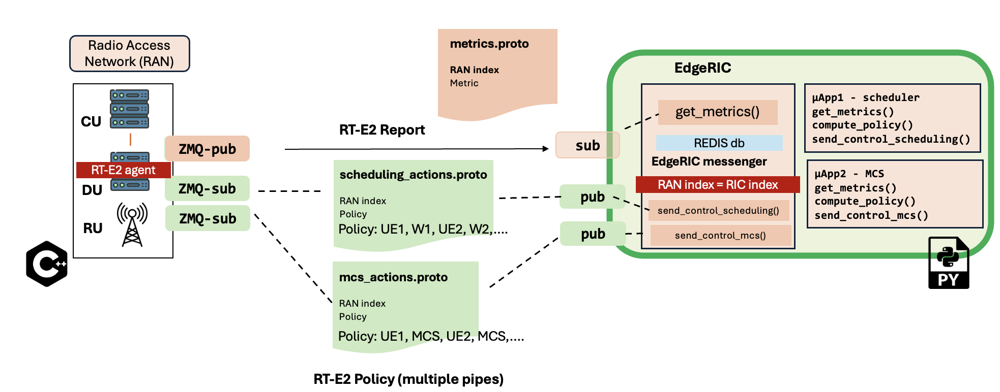

## Current Implementation 
  

## Repository structure
This repository is a collection of multiple folders containing the code for ``srsue (4G)``, ``modified srsgnb`` and ``edgeric``    
**Documentation for EdgeRIC compatible srsRAN** Located in [srsRAN-5G-ER](https://github.com/ucsdwcsng/srsRAN-5G-ER/tree/main)   
**Documentation for EdgeRIC-v2** Located in [edgeric-v2](https://github.com/ucsdwcsng/EdgeRIC-v2/tree/master)     
  
```bash
├── edgeric-v2        : Codebase for EdgeRIC
├── srs-4G-UE         : Codebase for srsue (4G)
├── srsRAN-5G-ER      : Codebase for srsRAN enb with EdgeRIC hooks 
├── open5gs           : This folder contains all the open5gs CN config files used in this repository
├── traffic-generator : This folder contains multiple traffic generator modules      
```

### Summary of all config file locations found in this repository
``/open5gs`` --> All open5gs configs  
**Configs below are for a 10MHz BW system, 20MHz settings are also available as comments**  
``/srs-4G-UE/.config/ue-4g-zmq.conf`` --> config file to run 1 srsue in zmq mode, check section ``[usim]`` and appropriately add those credentials in the open5gs webui database        
``/srs-4G-UE/.config/ue1-4g-zmq.conf`` --> config file for UE1 in multi UE zmq mode, check section ``[usim]`` and appropriately add those credentials in the open5gs webui database        
``/srs-4G-UE/.config/ue2-4g-zmq.conf`` --> config file for UE2 in multi UE zmq mode, check section ``[usim]`` and appropriately add those credentials in the open5gs webui database     
``/srs-4G-UE/.config/ue3-4g-zmq.conf`` --> config file for UE3 in multi UE zmq mode, check section ``[usim]`` and appropriately add those credentials in the open5gs webui database     
``/srs-4G-UE/.config/ue4-4g-zmq.conf`` --> config file for UE4 in multi UE zmq mode, check section ``[usim]`` and appropriately add those credentials in the open5gs webui database     
``/srsRAN-5G-ER/configs/n320-ota-amarisoft.yml`` --> run srsgnb in Over the air mode with usrp N320, in section ``cell_cfg`` you can change the band and bandwidth of operation      
``/srsRAN-5G-ER/configs/zmq-mode.yml`` --> run srsgnb in zmq mode with 1 srsue     
``/srsRAN-5G-ER/configs/zmq-mode-multi-ue.yml`` --> run srsgnb in zmq mode for multiple UEs     

For a full set of allowed configs from srsRAN, refer [here](https://docs.srsran.com/projects/project/en/latest/user_manuals/source/config_ref.html)

## Build the EdgeRIC compatible network
```bash
sudo ./make-ran-er.sh
```
## Run the Network
### Core Network: Ensure all open5gs services are running  
Installation of open5gs CN: [Open5gs installation](https://open5gs.org/open5gs/docs/guide/01-quickstart/)    
Use the config files in ``/open5gs`` - they should be fould in ``~/etc/open5gs`` of the machine 
```bash
$ sudo systemctl restart open5gs-mmed
$ sudo systemctl restart open5gs-sgwcd
$ sudo systemctl restart open5gs-smfd
$ sudo systemctl restart open5gs-amfd
$ sudo systemctl restart open5gs-sgwud
$ sudo systemctl restart open5gs-upfd
$ sudo systemctl restart open5gs-hssd
$ sudo systemctl restart open5gs-pcrfd
$ sudo systemctl restart open5gs-nrfd
$ sudo systemctl restart open5gs-scpd
$ sudo systemctl restart open5gs-seppd
$ sudo systemctl restart open5gs-ausfd
$ sudo systemctl restart open5gs-udmd
$ sudo systemctl restart open5gs-pcfd
$ sudo systemctl restart open5gs-nssfd
$ sudo systemctl restart open5gs-bsfd
$ sudo systemctl restart open5gs-udrd
$ sudo systemctl restart open5gs-webui
```
### Radio Access Network
Refer to ``srsRAN-5G-ER`` for documentation of the ``rt-agent`` 
#### Running in over the air mode 
Make sure you have UHD installed 
```bash
sudo ./run_gnb_ota.sh
```

#### Running in zmq mode with srsue

**GNU flowgraph**  
Run the GNU radio flowgraph - for two UEs run:
```bash
python3 2ue-zmq-mode-23.04Mhz.py
```
Run the GNU radio flowgraph - for four UEs run:
```bash
python3 4ue-zmq-mode-23.04Mhz.py
```
**Run the RAN**
```bash
sudo ./run_gnb_multi_ue.sh
```
### User Equipments
#### Running the srsue in zmq mode
For two UEs, you can run the script:
```bash
sudo ./run2ue-zmq-mode.sh
```
For four UEs, you can run the script:
```bash
sudo ./run4ue-zmq-mode.sh
```
You can also run the UEs in separate terminals

#### Running srsue with USRP
Update the UE config files, update ``[rf]`` section with the following, [refer here](https://docs.srsran.com/projects/project/en/latest/tutorials/source/srsUE/source/index.html#over-the-air-setup):  
``device_name = uhd``  
``device_args = ip_addr_of_sdr`` 

## Traffic Generation
More details: [traffic-generator](https://github.com/ushasigh/srsran-edgeric-5g/tree/main/traffic-generator)
```bash
cd traffic-generator
sudo ./iperf_server_2ues.sh
```

```bash
cd traffic-generator
sudo ./iperf_client_2ues.sh 13M 13M 1000
```

## How to run EdgeRIC?
Refer to ``edgeric-v2`` for documentation
